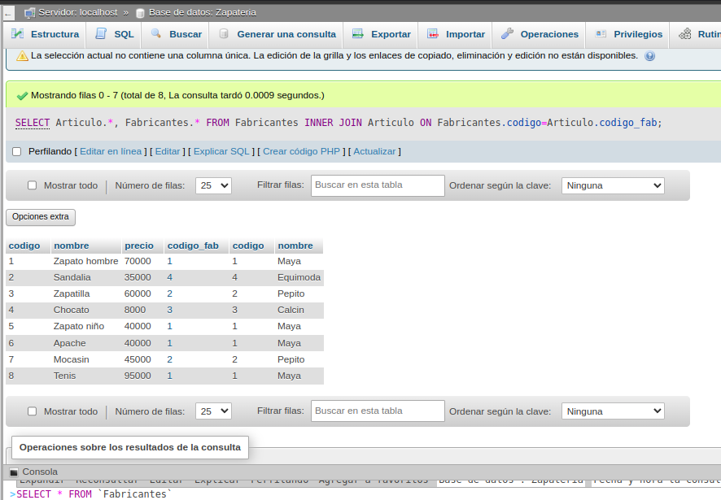

# BD-zapateria
## 

### CONSULTA No. 1
1. Obtener los nombres de los productos de la Zapateria

### CONSULTA No. 2
2. Obtener los nombres y los precios de los productos de la Zapatería.

### CONSULTA No. 3
3. Obtener el nombre de los productos cuyo precio sea menor o igual a 50000

### CONSULTA No. 4
4. Obtener todos los datos de los artículos cuyo precio esté entre 5000 y 40000 (ambas canditades incluidas)

## CONSULTA No. 5
5. Obtener el nombre y el precio de cada artículo, en dolares.

## CONSULTA No. 6
6. Obtener el precio promedio de todos los artículos

## CONSULTA No. 7
7. Obtener el precio medio de los artículos cuyo codigo de fabricante sea 2.

## CONSULTA No. 8
8. Obtener el número de artículos cuyo precio sea mayor o igual a 50000

## CONSULTA No. 9
9. Obtener el nombre y precio de los artículos cuyo precio sea mayor o igual a 50000 y ordenarlos descendentemente por precio, y luego ascendentemente por nombre.

## CONSULTA No. 10
10. Obtener un listado completo de artículos, incluyendo por cada articulo los datos del artículo y de su fabricante.

## CONSULTA No. 11
11. Obtener un listado de articulos, incluyendo el nombre del articulo, su precio y el nombre de su fabricante.

## CONSULTA No. 12
12. Obtener el precio medio de los productos  de cada frabricante, mostrando solo los codigos de fabricante.

## CONSULTA No. 13
13. Obtener el precio medio de los productos de cada fabricante, mostrando el nombre del fabricante.

## CONSULTA No. 14
14. Obtener el nombre de los fabricantes que ofrezcan productos cuyo precio medio sea mayor o igual a 50000

## CONSULTA No. 15
15. Obtener el nombre y el precio del artículo mas barato.
